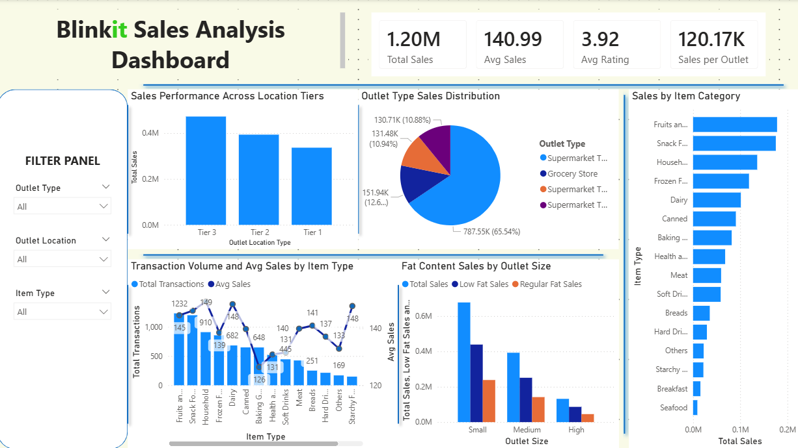
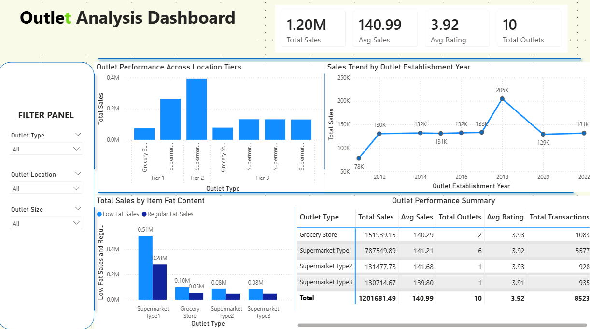
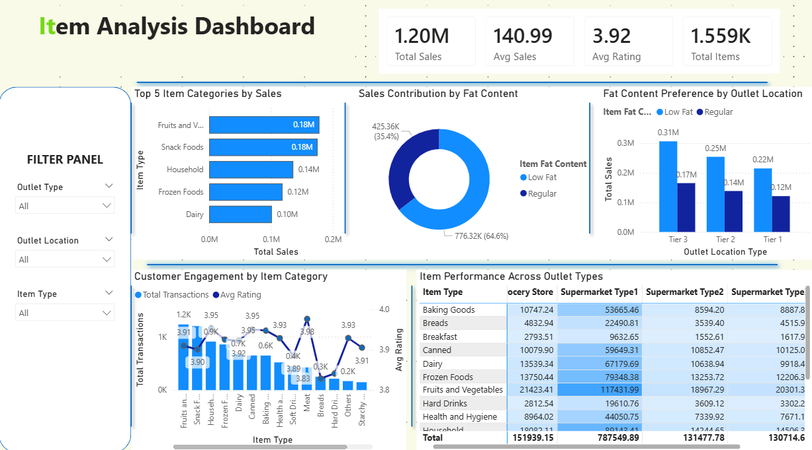
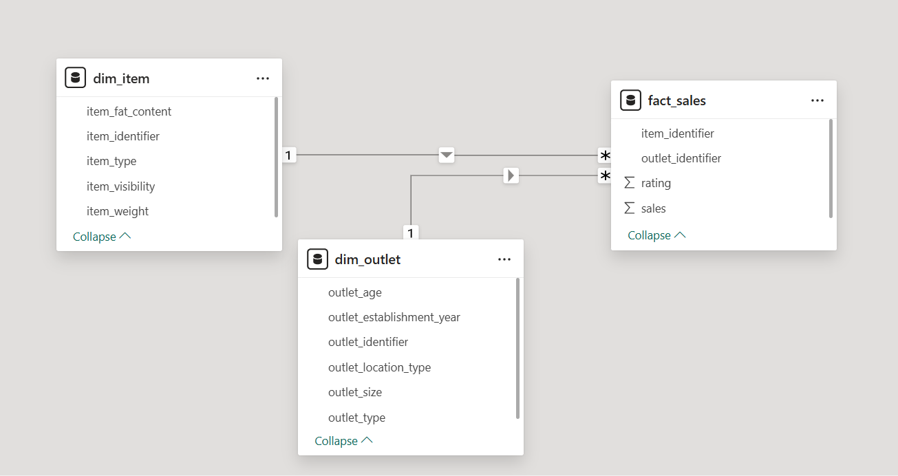

# Blinkit Grocery Sales & Outlet Performance Analysis

> End-to-end data analytics project — from raw Kaggle dataset to professional Power BI dashboard  
> **Python · Power BI · Star Schema · DAX · GitHub**

---

## Dashboard Preview

### Sales Analysis


### Outlet Analysis


### Item Analysis


---

## Business Problem

Blinkit operates across multiple outlet formats and city tiers selling
thousands of grocery items. This analysis answers 4 core business questions:

1. Which outlet type and location tier drives the highest sales?
2. Which item categories contribute most to revenue?
3. Does fat content or item visibility influence sales performance?
4. Does outlet establishment year correlate with sales performance?

---

## Key Findings

| # | Finding | Number |
|---|---------|--------|
| 1 | Supermarket Type1 dominates revenue | **65.54% (₹787K)** of total sales |
| 2 | All outlet types perform equally per item | Avg sales ~**₹141** across all formats |
| 3 | Tier 2 is most efficient location | **₹131K per outlet** vs ₹112K for Tier 1 |
| 4 | Outlets established in 2018 peak | **₹205K** — highest of any establishment year |
| 5 | Fruits & Veg and Snack Foods lead revenue | **₹0.18M each** — top 2 categories |
| 6 | Regular fat items dominate consistently | **64.6% (₹776K)** across all tiers |
| 7 | Customer ratings uniform across categories | Range only **3.83–3.98** across all items |

---

## Recommendations

1. **Prioritise Tier 2 expansion** with Supermarket Type1 format —
   highest revenue per outlet confirmed
2. **Stock top 3 categories aggressively** — Fruits & Veg, Snack Foods,
   Household drive disproportionate revenue
3. **Review Seafood and Breakfast** — lowest sales AND lowest ratings,
   candidate for catalogue reduction
4. **Redesign shelf space strategy** — item visibility has near-zero
   correlation with sales
5. **Develop outlet maturity programme** — post-2018 outlets
   underperform 2018 peak significantly

---

## Project Structure

```
blinkit-grocery-insights/
├── README.md
├── requirements.txt
├── .gitignore
├── data/
│   ├── raw/
│   │   └── BlinkIT Grocery Data.xlsx      ← original dataset
│   └── processed/
│       ├── dim_item.csv                   ← 1,559 unique items
│       ├── dim_outlet.csv                 ← 10 unique outlets
│       └── fact_sales.csv                 ← 8,523 transactions
├── notebooks/
│   ├── 01_eda.ipynb                       ← annotated EDA
│   └── 02_data_cleaning.ipynb             ← cleaning + star schema
├── docs/
│   ├── problem_statement.md
│   ├── data_dictionary.md
│   ├── data_model.md
│   ├── data_model_screenshot.png
│   └── dax_measures.md
├── reports/
│   ├── final_report.md                    ← findings + recommendations
│   └── screenshots/
│       ├── sales_overview.png
│       ├── outlet_analysis.png
│       └── item_analysis.png
└── powerbi/
    └── blinkit_dashboard.pbix
```

---

## Tech Stack

| Tool | Purpose |
|------|---------|
| Python (Pandas, NumPy) | Data cleaning and transformation |
| Matplotlib, Seaborn | EDA visualisation |
| Power BI Desktop | Data model, DAX measures, dashboard |
| GitHub | Version control and documentation |

---

## Data Model

Star schema engineered in Python from a single flat Kaggle table:

```
dim_item (1,559 rows)          dim_outlet (10 rows)
├── item_identifier [PK]        ├── outlet_identifier [PK]
├── item_type                   ├── outlet_type
├── item_fat_content            ├── outlet_size
├── item_weight                 ├── outlet_location_type
└── item_visibility             ├── outlet_establishment_year
                                └── outlet_age
          ↘                   ↙
            fact_sales (8,523 rows)
            ├── item_identifier [FK]
            ├── outlet_identifier [FK]
            ├── sales
            └── rating
```



---

## DAX Measures

11 measures built in Power BI `_Measures` table:

**Base:** Total Sales · Avg Sales · Avg Rating · Total Items ·
Total Outlets · Total Transactions

**Advanced:** Sales % of Total · Avg Sales vs Overall % ·
Low Fat Sales · Regular Fat Sales · Sales per Outlet

Full documentation → [`docs/dax_measures.md`](docs/dax_measures.md)

---

## Data Cleaning Summary

| Issue | Column | Fix Applied |
|-------|--------|-------------|
| 5 dirty values | Item Fat Content | Mapped to Low Fat / Regular |
| 17% nulls | Item Weight | Median imputation per Item Type |
| Zero values | Item Visibility | Mean imputation per Item Type |
| New feature | outlet_age | Derived: 2024 − establishment year |
| Star schema split | All columns | dim_item · dim_outlet · fact_sales |

Full cleaning notebook → [`notebooks/02_data_cleaning.ipynb`](notebooks/02_data_cleaning.ipynb)

---

## How to Run

**1 — Clone the repository:**
```bash
git clone https://github.com/yourusername/blinkit-grocery-insights
cd blinkit-grocery-insights
```

**2 — Install dependencies:**
```bash
pip install -r requirements.txt
```

**3 — Run notebooks in order:**
```
notebooks/01_eda.ipynb           → EDA and insights
notebooks/02_data_cleaning.ipynb → cleaning and star schema
```

**4 — Open Power BI dashboard:**
```
powerbi/blinkit_dashboard.pbix
```
Connect to `data/processed/` folder if prompted to refresh data source.

---

## Dataset

**Source:** [BlinkIT Grocery Data — Kaggle](https://www.kaggle.com/)  
**Rows:** 8,523 · **Columns:** 12 · **Unique Items:** 1,559 · **Outlets:** 10  
**Full column descriptions** → [`docs/data_dictionary.md`](docs/data_dictionary.md)

---

## Documentation

| Document | Description |
|----------|-------------|
| [`docs/problem_statement.md`](docs/problem_statement.md) | Business context, analytical questions, KPIs |
| [`docs/data_dictionary.md`](docs/data_dictionary.md) | Every raw column explained |
| [`docs/data_model.md`](docs/data_model.md) | Star schema design and relationships |
| [`docs/dax_measures.md`](docs/dax_measures.md) | All DAX measures documented |
| [`reports/final_report.md`](reports/final_report.md) | Full findings and recommendations |

---

## Author

**[Your Name]**  
Data Analyst  
[LinkedIn](https://linkedin.com/in/yourprofile) · [GitHub](https://github.com/yourusername)

---

*Built as part of a professional data analytics portfolio.  
Dataset: BlinkIT Grocery Data (Kaggle) · May 2026*